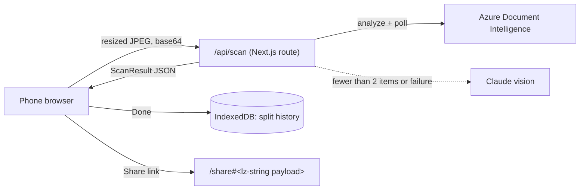

# CheckPlease

**Split the bill, not the friendship.**

CheckPlease is a mobile-first web app for splitting a restaurant bill. You take a photo of the receipt, tap who had what, and the app works out what each person owes, with tax and tip split fairly. Then you send everyone their total as a link or text, or request it on Venmo.

No accounts or sign-ups, and your friends don't need to install anything.

---

## Contents

- [For everyone](#for-everyone)
  - [What it does](#what-it-does)
  - [How to use it](#how-to-use-it)
  - [How the math works](#how-the-math-works)
  - [Privacy: where your data goes](#privacy-where-your-data-goes)
  - [FAQ](#faq)
- [For developers](#for-developers)
  - [Tech stack](#tech-stack)
  - [Getting started](#getting-started)
  - [Environment variables](#environment-variables)
  - [Scripts](#scripts)
  - [Project structure](#project-structure)
  - [Architecture](#architecture)
  - [Testing](#testing)
  - [Deployment](#deployment)
    - [Known limitations](#known-limitations)

---

# For everyone

## What it does

When the check comes, someone usually ends up doing math on their phone calculator, guessing at tax, and hoping it adds up. CheckPlease does that for you:

- 📷 **Reads the receipt for you.** Take a photo and the app finds every item and price.
- ✏️ **Lets you fix mistakes.** Check what it read, then fix, add, or remove items before splitting.
- 👥 **Handles shared dishes.** If three people split the nachos, each pays a third.
- 🧮 **Splits tax and tip fairly.** The more you ordered, the bigger your share of tax and tip.
- 🔗 **Shares results in one tap.** Send a link that shows everyone their total, or copy a text summary into a group chat.
- 💸 **Works with Venmo.** Add Venmo handles and request each person's amount from the results screen.
- ⭐ **Remembers your regulars.** Save groups (like "Roommates" or "Work lunch") so you don't have to type names every time.
- 🕘 **Keeps a history.** Past splits are saved on your phone, so you can look back at who owed what.

## How to use it

A new split has five steps. A progress bar at the top lets you go back to earlier steps.

| Step | What you do |
|---|---|
| **1. Who's splitting?** | Add everyone at the table (at least 2 people). Names you've used before appear as suggestions. You can also load a saved group, add optional Venmo handles, or save this table as a new group. |
| **2. Scan receipt** | Take a photo of the receipt, or choose one from your gallery. The app reads it in a few seconds. No receipt, or the scan can't read it? Tap **Enter items manually** and type the items yourself. |
| **3. Review items** | Check the items, prices, restaurant name, tax, tip, and currency (read from the receipt; correct it with the selector if it's wrong). Items marked ⚠ were hard to read, so double-check those. Fix anything that's wrong, remove extra lines, or add missing items. The total updates as you edit. An item the scan couldn't price is outlined in red — type the price or delete the row, since you can't continue while one is unfinished. |
| **4. Assign items** | Tap a person's name under each item to assign it to them. Tap several names for a shared item, or **All** for something everyone shared. **Split equally between everyone** assigns every item to the whole table. You can't continue until every item is assigned. Unassigned items are outlined in red. |
| **5. Totals** | See each person's total and what's in it. Tap **Share link** or **Copy text** to send results, **Show QR code** to let people at the table scan it, or **Request on Venmo** next to a person. Tap **Done** to save the split to your history. |

**Tip:** Tap **Add your Venmo** at the top of the home screen to save your own handle. It's added to the end of the copied text so people know where to pay you.

### What your friends see

When you share a link, your friends open a read-only page with everyone's totals and itemized breakdowns. They don't need the app, an account, or any setup.

## How the math works

Say Alex and Sam share a $12 appetizer, and Alex also orders a $20 entrée.

1. **Items:** Shared items are split evenly. Alex's items come to $6 + $20 = $26, and Sam's to $6.
2. **Tax and tip:** These are split in proportion to what each person ordered. The food total is $32, and Alex's share of it is $26, so Alex pays 26/32 (about 81%) of the tax and tip. Sam pays the rest.
3. **Rounding:** Every amount is rounded to the cent. If rounding makes the totals a few cents off from the bill, the difference goes to the person with the largest total.

This is how most people would split a bill by hand, just faster and without the arithmetic mistakes.

## Privacy: where your data goes

- **Receipt photo.** The photo is shrunk on your phone and sent to the app's server, which passes it to a receipt-reading service (Microsoft Azure, with Anthropic's Claude as a backup). CheckPlease doesn't store the photo.
- **Everything else stays on your device.** Names, groups, Venmo handles, and split history are stored in your browser. CheckPlease has no database and no user accounts.
- **Share links contain the split.** The whole split (names, items, prices, and Venmo handles) is packed into the link itself. Anyone who has the link can see those details, so share it only with the people involved.
- **Clearing your browser data** deletes your history and saved groups. They aren't backed up anywhere.

## FAQ

**The scan got something wrong.**
That happens, especially with crumpled receipts, bad lighting, or handwritten tips. The Review step exists for this: fix any item before you assign it. If the scan fails completely, retake the photo in better light.

**Can I use it without a receipt?**
Yes. On the Scan step, tap **Enter items manually** and type each item and price. The rest of the split works the same.

**Does it read receipts in other languages?**
Yes. The scanner supports around 115 languages, so a receipt in Spanish, Japanese, Arabic or Hebrew reads fine and item names come through as printed. The app's own buttons and labels are English only.

**Does it work with a screen reader or keyboard?**
Yes. Every control is reachable by keyboard, fields are labelled, and status changes (scan progress, "1 item needs a price", "Copied to clipboard") are announced. Errors are never signalled by colour alone.

**Does it work on iPhone and Android?**
Yes. It runs in your phone's browser. You can also use **Add to Home Screen** so it opens like an app.

**Does it support currencies other than US dollars?**
Yes. The currency is read from the receipt and you can correct it on the Review step. Amounts then display in that currency everywhere, including the shared link and copied text. "Request on Venmo" is hidden outside US dollars, since Venmo is US-only.

**Can I delete a past split?**
Yes. Open the split from the home screen or All Splits, then tap **Delete split** at the bottom and confirm. It's gone for good — there's no undo and no backup. Saved groups are deleted the same way, from the group's edit screen.

**I got interrupted halfway through a split. Did I lose it?**
No. The app saves as you go, and the home screen shows a **Resume split** card. The only thing not kept is the receipt photo, so if you were still on the scan step you'd retake it.

**Why does "Request on Venmo" not do anything?**
The button opens the Venmo app, so it only works on a phone with Venmo installed.

---

# For developers

## Tech stack

| Layer | Choice |
|---|---|
| Framework | [Next.js](https://nextjs.org) 16 (App Router), React 19, TypeScript |
| Styling | Tailwind CSS v4 |
| Receipt OCR (primary) | Azure AI Document Intelligence, `prebuilt-receipt` model |
| Receipt OCR (fallback) | Claude Opus 5 vision + structured outputs via `@anthropic-ai/sdk` |
| Rate limiting | [`@upstash/ratelimit`](https://github.com/upstash/ratelimit-js) + Upstash Redis on `/api/scan` |
| Local persistence | IndexedDB via [`idb`](https://github.com/jakearchibald/idb) for split history; `localStorage` for groups, names, settings, and the in-progress draft |
| Share links | [`lz-string`](https://github.com/pieroxy/lz-string) compression in the URL hash; [`qrcode`](https://github.com/soldair/node-qrcode) renders the same link as a QR |
| Money formatting | `Intl.NumberFormat` pinned to `en-US`, currency per split (`src/lib/money.ts`) |
| Accessibility | WCAG 2.1 AA: labelled controls, `role="status"` live regions, `aria-pressed` toggles, `aria-invalid` on bad fields; axe-core clean on every screen |
| Install on a phone | PWA: web manifest + `apple-icon.png`, added to the home screen. No native wrapper. |
| Tests | Jest + ts-jest, jsdom for component tests, `fake-indexeddb` for the storage layer |
| Hosting | Vercel |

> ⚠️ **Heads-up for contributors:** This project uses Next.js 16, which has breaking changes from older versions. Before changing framework-level code, read the relevant guide in `node_modules/next/dist/docs/` (see [`AGENTS.md`](AGENTS.md)).

## Getting started

**Prerequisites:** Node.js 20+ and npm.

```bash
git clone https://github.com/Gordonlee97/CheckPlease.git
cd CheckPlease
npm install
```

Create a `.env.local` file in the project root (see [Environment variables](#environment-variables)), then run:

```bash
npm run dev
```

Open [http://localhost:3000](http://localhost:3000). The UI is designed for phones, so use your browser's device emulation or open the dev server from a phone on the same network.

## Environment variables

Put these in `.env.local`. All `.env*` files are gitignored.

| Variable | Where it's used | Required | Description |
|---|---|---|---|
| `AZURE_DI_ENDPOINT` | Server | Recommended | Your Azure Document Intelligence endpoint, e.g. `https://<resource>.cognitiveservices.azure.com` |
| `AZURE_DI_KEY` | Server | Recommended | Azure Document Intelligence API key |
| `ANTHROPIC_API_KEY` | Server | Yes | Anthropic API key for the Claude fallback |
| `UPSTASH_REDIS_REST_URL` | Server | Production | Upstash Redis REST URL, for rate limiting `/api/scan` |
| `UPSTASH_REDIS_REST_TOKEN` | Server | Production | Upstash Redis REST token |
| `NEXT_PUBLIC_SCAN_API_URL` | Client | No | Full URL of the scan endpoint. Defaults to `/api/scan`. Only needed if the client is served somewhere without the API route. |
| `NEXT_PUBLIC_SHARE_BASE_URL` | Client | No | Base URL used in share links. Defaults to `window.location.origin`. |

If the Azure variables aren't set, every scan goes straight to Claude. The app still works, but it's slower and item confidence warnings (⚠) won't appear.

If the Upstash variables aren't set, scanning still works but **nothing is rate limited**, and a warning is logged at startup. `KV_REST_API_URL` / `KV_REST_API_TOKEN` also work: those are the names Vercel's Upstash marketplace integration injects.

```bash
# .env.local
AZURE_DI_ENDPOINT=https://your-resource.cognitiveservices.azure.com
AZURE_DI_KEY=your-azure-key
ANTHROPIC_API_KEY=sk-ant-...
```

## Scripts

| Command | What it does |
|---|---|
| `npm run dev` | Start the dev server on port 3000 |
| `npm run build` | Production build |
| `npm start` | Serve the production build |
| `npm run lint` | Run ESLint |
| `npm test` | Run the Jest unit tests |

## Project structure

```
src/
├── app/
│   ├── page.tsx              # Home: groups, recent splits, your Venmo handle
│   ├── new/page.tsx          # New split wizard (owns draft state + step navigation)
│   ├── share/page.tsx        # Read-only split decoded from the URL hash
│   ├── history/page.tsx      # A single saved split (?id=...)
│   ├── splits/page.tsx       # All saved splits
│   ├── groups/page.tsx       # All saved groups
│   ├── groups/edit/page.tsx  # Create / edit / delete a group (?id=... or ?id=new)
│   └── api/scan/route.ts     # POST /api/scan: OCR proxy (Azure → Claude fallback)
├── components/
│   ├── steps/                # AddPeople, Scan, Review, Assign, SummaryView
│   ├── ui/                   # Button, Card, Input
│   └── ProgressBar.tsx
└── lib/
    ├── types.ts              # Session, Person, Item, ScanResult
    ├── splitting.ts          # computeSplit(): per-person totals
    ├── ocr.ts                # Parse Azure and Claude responses into ScanResult
    ├── share.ts              # Share-link encoding and plain-text summary
    ├── storage.ts            # IndexedDB split history (save/list/get/delete)
    ├── draft.ts              # localStorage: the in-progress split
    ├── localStorageStore.ts  # useSyncExternalStore plumbing for the stores below
    ├── savedGroups.ts        # localStorage: groups
    ├── savedNames.ts         # localStorage: name autocomplete
    ├── userSettings.ts       # localStorage: your Venmo handle
    ├── rateLimit.ts          # Per-IP scan limit (server)
    ├── scanErrors.ts         # Maps API failures to messages users can act on
    ├── money.ts              # Currency formatting and validation
    ├── qr.ts                 # Share link as a scannable QR code
    ├── imageUtils.ts         # Client-side image resize → base64
    └── personColors.ts       # Per-person color palette
__tests__/                    # Jest tests: splitting, OCR, sharing, storage, draft, steps
test-utils/                   # Jest setup (structuredClone polyfill for jsdom)
docs/superpowers/             # Original design spec and implementation plan
```

Routes use query parameters (`?id=`, `?group=`) instead of dynamic segments, so pages stay simple client components.

## Architecture



### Receipt scanning (`/api/scan`)

1. The client resizes the photo to a maximum of 1024 px on the long edge (JPEG quality 0.85), which keeps the upload under Vercel's 4.5 MB request limit. It then POSTs the base64 string as the `image` form field.
2. The route checks the per-IP rate limit (`src/lib/rateLimit.ts`, 10 scans/hour, sliding window) before reading the body, and returns `429` with `Retry-After` when it's exceeded.
3. It submits the image to Azure's `prebuilt-receipt` model and polls the operation with exponential backoff (up to about 20 polls).
4. If Azure isn't configured, fails, or returns fewer than 2 items, the route sends the image to Claude Opus 5. A Zod schema passed as `output_config.format` constrains the reply, so no JSON is parsed out of free text. Server-side refusal fallbacks are enabled; a refusal that survives them is treated as an unreadable receipt.
5. When Azure succeeds but flags any item below 0.8 confidence, Claude re-reads the same photo and its price is used for those items only (`reconcileLowConfidence`). Agreement clears the ⚠; disagreement keeps it. A failure here is logged and Azure's result still stands.
6. The response is a `ScanResult`: `{ label, items[{ name, price, confidence? }], subtotal, tax, tip, total }`. The route returns `422` if neither service can read the receipt.

API keys stay on the server. CORS is limited to an allowlist in `route.ts` (localhost, `capacitor://localhost`, and the production domain).

### Splitting (`src/lib/splitting.ts`)

`computeSplit(people, items, tax, tip, receiptTotal)` returns one `PersonShare` per person:

```
itemSubtotal = Σ item.price / item.assignedTo.length   (for items assigned to that person)
taxShare     = itemSubtotal / Σ all item prices × tax
tipShare     = itemSubtotal / Σ all item prices × tip
total        = itemSubtotal + taxShare + tipShare       (each rounded to cents)
```

The denominator is the sum of item prices after the user's edits, not the subtotal printed on the receipt. If the rounded totals differ from the receipt total by 5¢ or less, the difference is added to the largest share (to its tax, then tip, then items). Larger differences are left alone because they mean the inputs don't agree, and forcing them into one share could produce negative values.

### State and persistence

- **In progress:** The draft split is React state in `app/new/page.tsx`, mirrored to `localStorage` by `src/lib/draft.ts` on every change, so a refresh doesn't lose it. Each step exposes a `submit()` handle, reports readiness through `onReadyChange` (driving the fixed bottom button), and reports edits through `onEdit` so keystrokes reach the draft before the step is submitted. The receipt photo isn't part of the draft — a `File` can't be serialized. The home screen offers the draft as a **Resume split** card (`/new?resume=1`); nothing resumes automatically.
- **Finished splits:** Saved to IndexedDB (database `checkplease`, store `sessions`) when the user taps **Done**, which also clears the draft. Deleting a split (`deleteSession`) is permanent.
- **Groups, name suggestions, your Venmo handle, the draft:** `localStorage` under keys prefixed with `checkplease:`. Components read them through `useSyncExternalStore` (`src/lib/localStorageStore.ts`), so a write from anywhere updates every screen showing that data, and reads stay hydration-safe on prerendered pages.

### Sharing

- **Link:** The whole `Session` is serialized to JSON, compressed with `lz-string`, and placed after `#` in `/share#<payload>`. The hash never reaches the server, and the share page recomputes the split on the client. Links never expire because nothing is stored anywhere.
- **Text:** `buildPlainText()` produces a chat-friendly summary.
- **QR:** `buildQrImage()` encodes the same link for scanning at the table. It returns the image's natural size and the summary renders it 1:1 — CSS-scaling a QR smooths module edges and stops dense codes from scanning. Links over 2000 characters (very long receipts) get a "use Share link instead" message rather than an unscannable code.
- **Venmo:** Each person's card links to `venmo://paycharge?txn=charge&recipients=<handle>&amount=<total>&note=<restaurant>`. A combined "request everyone at once" link was removed because Venmo deep links don't support multiple amounts.

## Testing

```bash
npm test
```

The unit tests cover the pure logic, which is where the math and parsing live:

- `__tests__/splitting.test.ts`: proportional tax/tip, shared items, and rounding
- `__tests__/ocr.test.ts`: Azure and Claude response parsing
- `__tests__/share.test.ts`: link encode/decode round-trip and text formatting

UI components and the `/api/scan` route don't have automated tests.

## Deployment

The app is built for [Vercel](https://vercel.com):

1. Import the repository in Vercel.
2. Add `AZURE_DI_ENDPOINT`, `AZURE_DI_KEY`, and `ANTHROPIC_API_KEY` under **Project → Settings → Environment Variables**.
3. Add Upstash Redis for rate limiting, either way round:
   - **Storage → Create Database → Upstash for Redis**, then connect it to the project. Vercel injects `KV_REST_API_URL` / `KV_REST_API_TOKEN`.
   - Or create one at [console.upstash.com](https://console.upstash.com) and add `UPSTASH_REDIS_REST_URL` / `UPSTASH_REDIS_REST_TOKEN` yourself.
4. Deploy. The scan route sets `maxDuration = 60` so Azure polling plus the Claude fallback has time to finish. Environment variables only reach new deployments, so redeploy after changing them.

If you deploy to a domain other than `checkplease.vercel.app`, add it to `ALLOWED_ORIGINS` in `src/app/api/scan/route.ts`.

The app includes a web manifest (`public/manifest.json`) plus `src/app/apple-icon.png`, so it installs to a phone's home screen with the right icon on both Android and iOS.

## Native apps

There are none, by choice. CheckPlease installs to a phone's home screen as a PWA, which covers what a wrapper would mostly have provided. Capacitor dependencies and `build:ios` / `build:android` scripts used to sit in `package.json`, but without a `capacitor.config`, native projects, or a static export they could never run, so they were removed.

If App Store or Play listings are wanted later, the pieces needed are: `output: 'export'` in `next.config.ts`, a Capacitor config, `npx cap add ios/android`, and `NEXT_PUBLIC_SCAN_API_URL` / `NEXT_PUBLIC_SHARE_BASE_URL` pointed at the hosted deployment, since a packaged app has no API route of its own. The business logic transfers unchanged. `capacitor://localhost` is still in the CORS allowlist for that eventuality.

## Known limitations

- **One draft at a time.** Starting a new split replaces the saved one (after a confirm), and the receipt photo isn't part of the draft.
- **Receipt discounts and service charges** aren't treated specially. They come through as whatever the OCR returns, so check them on the Review step.
- **The scan endpoint has no authentication**, only a per-IP rate limit and a CORS allowlist. Browsers honour CORS; `curl` doesn't. Anyone who finds the URL can send it up to 10 images an hour per IP, spending your Azure and Anthropic credits. Spending caps in those consoles are the backstop.
